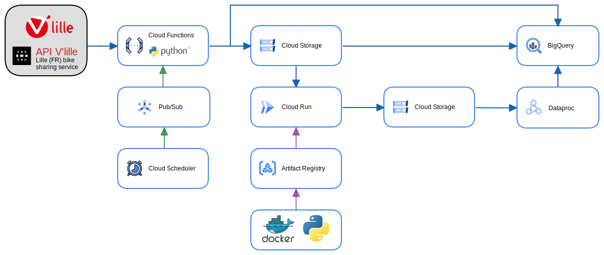
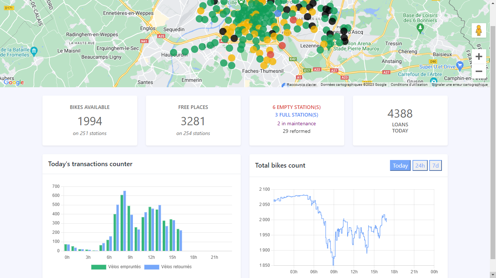

# V'lille GCP

Collecting data from the <a href="https://opendata.lillemetropole.fr/explore/dataset/vlille-realtime/information/?flg=fr-fr&disjunctive.libelle&disjunctive.nom">V'lille API (Real-time station availability)</a>, storing and processing it on GCP: Storage, Dataproc, Functions, Pub/Sub, Scheduler, BigQuery, Run + Docker.

The goal of this project is to interconnect commonly used GCP services in data processing.

<p>
    
</p>

<p align="center">
    <a href="https://dashboard-service-bohzwljmja-od.a.run.app/">
            
            https://dashboard-service-bohzwljmja-od.a.run.app
    </a>
</p>

Ressources :
* <a href="https://cloud.google.com/sdk/docs?hl=fr">Google Cloud CLI Documenttion</a>
* <a href="https://github.com/googleapis/google-cloud-python">Google Cloud Client Library for Python</a>


## 1. GCP Project Creation and Configuration

Create a project on GCP after authenticating with Google Cloud CLI.

```sh
# Creating a new gcloud project
gcloud projects create vlille-gcp

# List projects
gcloud projects list

# Project activation
gcloud config set project vlille-gcp

# Creating a service account
gcloud iam service-accounts create admin-vlille-gcp

# List service accounts
gcloud iam service-accounts list
# admin-vlille-gcp@vlille-gcp.iam.gserviceaccount.com

# Granting permissions (bigquery admin) to the service account
gcloud projects add-iam-policy-binding vlille-gcp --member="serviceAccount:admin-vlille-gcp@vlille-gcp.iam.gserviceaccount.com" --role="roles/bigquery.admin"

# Granting permissions (storage admin) to the service account
gcloud projects add-iam-policy-binding vlille-gcp --member="serviceAccount:admin-vlille-gcp@vlille-gcp.iam.gserviceaccount.com" --role="roles/storage.admin"

# Creating a key for the service account
gcloud iam service-accounts keys create key-vlille-gcp.json --iam-account=admin-vlille-gcp@vlille-gcp.iam.gserviceaccount.com

# Linking the billing account to the project
gcloud alpha billing accounts list
# ACCOUNT_ID            NAME                       OPEN  MASTER_ACCOUNT_ID
# 012A63-E71939-70F754  My Billing Account         True
gcloud alpha billing projects link vlille-gcp --billing-account=012A63-E71939-70F754

```

## 2. Data Collection and Storage from API (Functions, Pub/Sub, Scheduler), BigQuery

Using Cloud Functions to collect data from the V'lille API and store it in a GCS bucket as well as a BigQuery table, triggered every minute by Pub/Sub + Scheduler.

```sh
# Enabling APIs: Build, Functions, Pub/Sub, Scheduler
gcloud services enable cloudbuild.googleapis.com
gcloud services enable cloudfunctions.googleapis.com
gcloud services enable pubsub.googleapis.com
gcloud services enable cloudscheduler.googleapis.com

# Creating GCS bucket for data collection
gcloud storage buckets create gs://vlille_gcp_data
# Creating GCS bucket for function storage
gcloud storage buckets create gs://vlille_gcp_bucket

# Creating a BigQuery dataset
bq mk vlille_gcp_dataset 
# Dataset 'vlille-gcp:vlille_gcp_dataset' successfully created
```

Creating the BigQuery tables (3 ways) :

* 1st way : using BigQuery UI :

```SQL
CREATE TABLE vlille_gcp_dataset.stations (
    id INT64,
    name STRING,
    libelle STRING,
    adress STRING,
    city STRING,
    type STRING,
    latitude FLOAT64,
    longitude FLOAT64
);


CREATE TABLE vlille_gcp_dataset.records (
    station_id INT64,
    operational_state STRING,
    nb_available_bikes INT64,
    nb_available_places INT64,
    connexion STRING,
    last_update TIMESTAMP,
    record_timestamp TIMESTAMP
);
```

* 2nd way : using gcloud CLI :

Tables schemas :

```javascript
// json_list_schema_stations.json
[
    {"name": "id",                  "type": "INT64"},
    {"name": "name",                "type": "STRING"},
    {"name": "libelle",             "type": "STRING"},
    {"name": "adress",              "type": "STRING"},
    {"name": "city",                "type": "STRING"},
    {"name": "type",                "type": "STRING"},
    {"name": "latitude",            "type": "FLOAT64"},
    {"name": "longitude",           "type": "FLOAT64"}
]

// json_list_schema_records.json
[
    {"name": "station_id",          "type": "INT64"},
    {"name": "operational_state",   "type": "STRING"},
    {"name": "nb_available_bikes",  "type": "INT64"},
    {"name": "nb_available_places", "type": "INT64"},
    {"name": "connexion",           "type": "STRING"},
    {"name": "last_update",         "type": "TIMESTAMP"},
    {"name": "record_timestamp",    "type": "TIMESTAMP"}
]
```

Creating the tables :

```sh
bq mk --table vlille_gcp_dataset.stations json_list_schema_stations.json

bq mk --table vlille_gcp_dataset.records json_list_schema_records.json
```

* rd way : using Python client, more convenient for populating the stations table :

```python
from google.cloud import bigquery
import requests
import os
import sys

os.environ["GOOGLE_APPLICATION_CREDENTIALS"] = "key-vlille.json"

client = bigquery.Client()

# get the args from the command line
try:
    project_id = sys.argv[1]
    dataset_id = sys.argv[2]
except Exception as e:
    print(e)
    print("Usage: python create_tables.py <project_id> <dataset_id>")
    sys.exit(1)

# Create a 'stations' table
table_id = project_id + '.' + dataset_id + '.stations'

stations_schema = [
    bigquery.SchemaField("id",          "INT64"), # id = libelle
    bigquery.SchemaField("name",        "STRING"),
    bigquery.SchemaField("adress",      "STRING"),
    bigquery.SchemaField("city",        "STRING"),
    bigquery.SchemaField("type",        "STRING"),
    bigquery.SchemaField("latitude",    "FLOAT64"),
    bigquery.SchemaField("longitude",   "FLOAT64"),
]
table = bigquery.Table(table_id, schema=stations_schema)
table = client.create_table(table)  # Make an API request.
print(
    "Created table {}.{}.{}".format(table.project, table.dataset_id, table.table_id)
)

# Create a 'records' table
table_id = project_id + '.' + dataset_id + '.records'
record_schema = [
    bigquery.SchemaField("station_id",              "INT64"),
    bigquery.SchemaField("operational_state",       "STRING"),
    bigquery.SchemaField("nb_available_bikes",      "INT64"),
    bigquery.SchemaField("nb_available_places",     "INT64"),
    bigquery.SchemaField("connexion",               "STRING"),
    bigquery.SchemaField("last_update",             "TIMESTAMP"),
    bigquery.SchemaField("record_timestamp",        "TIMESTAMP"),
]
table = bigquery.Table(table_id, schema=record_schema)
table = client.create_table(table)  # Make an API request.
print(
    "Created table {}.{}.{}".format(table.project, table.dataset_id, table.table_id)
)

# Populate the stations table once with a query:
url = "https://opendata.lillemetropole.fr/api/records/1.0/search/?dataset=vlille-realtime&rows=300&facet=libelle&facet=nom&facet=commune&facet=etat&facet=type&facet=etatconnexion"
response = requests.get(url)
data = response.json()

rows_to_insert = []
for record in data["records"]:
    rows_to_insert.append(
        (
            record["fields"]["libelle"], # id = libelle
            record["fields"]["nom"],
            record["fields"]["adresse"],
            record["fields"]["commune"],
            record["fields"]["type"],
            record["fields"]["localisation"][0],
            record["fields"]["localisation"][1],
        )
    )

table_id = project_id + '.' + dataset_id + '.stations'
try:
    table = client.get_table(table_id)
    client.insert_rows(table, rows_to_insert)
    print("Station's rows inserted into table {}".format(table_id))
except Exception as e:
    print(e)
```

### 2.1. Cloud Function : content and script transfert to GCS bucket

```txt
function/<br>
├── key-vlille-gcp.json<br>
├── requirements.txt<br>
└── main.py
```

* main.py

```python
import base64
from datetime import datetime
from google.cloud import storage
from google.cloud import bigquery
import requests
import json
import pytz
import os

# Define variables for Cloud Functions
project_name = 'vlille-gcp'
bucket_name = 'vlille_gcp_data'
dataset_id = 'vlille_gcp_dataset'
table_id = 'records'
os.environ["GOOGLE_APPLICATION_CREDENTIALS"] = "key-vlille-gcp.json"

url = 'https://opendata.lillemetropole.fr/api/records/1.0/search/?dataset=vlille-realtime&q=&rows=300&timezone=Europe%2FParis'
paris_tz = pytz.timezone('Europe/Paris')
str_time_paris = datetime.now(paris_tz).strftime('%Y-%m-%d_%H:%M:%S')


def get_json_data(url):
    # extract data from API
    response = requests.get(url)
    return response.json()

def store_data_json_to_gcs_bucket(data, bucket_name, str_time_paris):
    # store data to GCS bucket
    storage_client = storage.Client()
    bucket = storage_client.bucket(bucket_name)

    # Replace with the desired object name
    object_name = "data___" + str_time_paris + ".json"
    
    
    # ========== Anticipating Spark process : ================== #
    # replace object_name characters ":" and "-" with "_", 
    object_name = object_name.replace(":", "_").replace("-", "_")
    # ========================================================== #

    blob = bucket.blob(object_name)

    # Convert data to JSON string and upload to GCS
    json_data = json.dumps(data)
    blob.upload_from_string(json_data)


def insert_data_json_to_bigquery(data):
    client = bigquery.Client(project=project_name)
    table_ref = client.dataset(dataset_id).table(table_id)
    table = client.get_table(table_ref)  # API call

    data_to_insert = []
    for record in data['records']:
        row = {}
        row["station_id"]           = record["fields"]["libelle"]
        row["operational_state"]    = record["fields"]["etat"]
        row["nb_available_bikes"]   = record["fields"]["nbvelosdispo"]
        row["nb_available_places"]  = record["fields"]["nbplacesdispo"]
        row["connexion"]            = record["fields"]["etatconnexion"]
        row["last_update"]          = record["fields"]["datemiseajour"]
        row["record_timestamp"]     = record["record_timestamp"]
        data_to_insert.append(row)
    client.insert_rows(table, data_to_insert)


def vlille_pubsub(event, context):
    pubsub_message = base64.b64decode(event['data']).decode('utf-8')
    print(pubsub_message)
    str_time_paris = datetime.now(paris_tz).strftime('%Y_%m_%d_%H_%M_%S')

    try:
        json_data = get_json_data(url)
        print("Data extracted from API")
    except Exception as e:
        print(e)
    
    try:
        store_data_json_to_gcs_bucket(json_data, bucket_name, str_time_paris)
        print("File uploaded to gs://" +  bucket_name + "/{}.".format("data___" + str_time_paris + ".json"))
    except Exception as e:
        print(e)

    try:
        insert_data_json_to_bigquery(json_data)
        print("Data inserted into BigQuery")
    except Exception as e:
        print(e)


if __name__ == "__main__":
    vlille_pubsub('data', 'context')
```

Zipping the function's folder and transferring to a GCS bucket:

```sh
Compress-Archive -Path function/main.py, function/requirements.txt, function/key-vlille-gcp.json -DestinationPath cloud-function-vlille-gcp.zip

# Transfer the cloud-function-vlille-gcp.zip file
gsutil cp cloud-function-vlille-gcp.zip gs://vlille_gcp_bucket
```

### 2.2. Pub/Sub Topic Creation:

```sh
# Creating a Pub/Sub topic: cloud-function-trigger-vlille
gcloud pubsub topics create cloud-function-trigger-vlille
```

### 2.3. Job scheduler

```sh
# Creating a job scheduler that sends a message to the Pub/Sub topic cloud-function-trigger-vlille every minute
gcloud scheduler jobs create pubsub cf-vlille-minute --schedule="* * * * *" --topic=cloud-function-trigger-vlille --message-body="{Message from the cf-vlille-minute Pub/Sub scheduler}" --time-zone="Europe/Paris" --location=europe-west1 --description="Scheduler every minute"

# Manually triggering the job scheduler
gcloud scheduler jobs run cf-vlille-minute --location=europe-west1

# List of job schedulers
gcloud scheduler jobs list

# Pausing the job scheduler
gcloud scheduler jobs pause cf-vlille-minute --location=europe-west1

# Deleting the job scheduler
gcloud scheduler jobs delete cf-vlille-minute --location=europe-west1
```

### 2.5. Cloud Functions Deployment:
  
```sh
# Creating a Cloud Function triggered by the Pub/Sub topic cloud-function-trigger-vlille
gcloud functions deploy vlille_scheduled_function --region=europe-west1 --runtime=python311 --trigger-topic=cloud-function-trigger-vlille --source=gs://vlille_gcp_bucket/cloud-function-vlille-gcp.zip --entry-point=vlille_pubsub

# Viewing logs:
gcloud functions logs read vlille_scheduled_function --region=europe-west1
```

## 3. Flask dashboard (charts.js & google maps) + Docker + Cloud Run

Using :

* <a href="https://developers.google.com/maps/documentation/javascript/overview">Google API maps Javascript</a>

* <a href="https://www.chartjs.org/">Charts.js</a> to display the data from the BigQuery tables.

* <a href="https://github.com/xriley/portal-theme-bs5">Portal Bootstrap 5 Theme</a> template.

### 3.1. Flask

``` txt
dashboard_app/ 
├── static/ 
│   ├── css/ 
│   │   ├── style.css       -- my css styles
│   │   └── portal.css      -- template's css styles
│   ├── js/
│   │   ├── addMarker.js    -- google maps
│   │   ├── initMap.js      -- google maps
│   │   ├── app.js          -- general js scripts
│   │   ├── display[...].js -- chart.js
│   │   └── fetch[...].js   -- chart.js
│   ├── images/ 
│   ├── plugins/ 
│   └── scss/ 
├── templates/ 
│   └── index.html          -- template to render by Flask
├── app.py                  -- Flask API
├── Dockerfile 
├── GOOGLE_MAPS_API_KEY.txt 
├── key-vlille-gcp.json 
└── requirements.txt        -- Flask dependencies for Docker build
```

app.py :

* On the entry point, we request the data from the bike sharing service API and render the dashboard's template index.html

```python
from datetime import datetime, timedelta
from flask import Flask, render_template, request, jsonify
from google.cloud import bigquery
import pandas as pd
import os
import requests

project_id = "vlille-gcp"
dataset_name = "vlille_gcp_dataset"

os.environ["GOOGLE_APPLICATION_CREDENTIALS"] = "key-" + project_id + ".json"
with open('GOOGLE_MAPS_API_KEY.txt', 'r') as f:
    GOOGLE_MAPS_API_KEY = f.read()

client = bigquery.Client()

app = Flask(__name__)

@app.route('/')
def index():
    # Real-time stations infos are requested from the bike sharing service API, and stored in the variable stations_infos via the get_realtime_data call. 
    # Data is used by the google maps API for displaying markers and stations informations on the map
    stations_infos = get_realtime_data()
    
    # General stats for html displaying
    general_infos = {
        "nb_available_bikes":                           sum([station["nb_available_bikes"] for station in stations_infos]),
        "nb_available_places":                          sum([station["nb_available_places"] for station in stations_infos]),
        "nb_empty_stations":                            sum([(station["nb_available_bikes"] == 0) and (station['operational_state'] == "EN SERVICE") for station in stations_infos]),
        "nb_full_stations":                             sum([(station["nb_available_places"] == 0) and (station['operational_state'] == "EN SERVICE") for station in stations_infos]),
        "nb_stations_w_n_bikes_greater_than_zero":      sum([station["nb_available_bikes"] > 0 and (station['operational_state'] == "EN SERVICE") for station in stations_infos]),
        "nb_stations_w_n_places_greater_than_zero":     sum([(station["nb_available_places"] > 0) and (station['operational_state'] == "EN SERVICE") for station in stations_infos]),
        "nb_stations_in_serice":                        sum([station["operational_state"] == "EN SERVICE" for station in stations_infos]),
        "nb_stations_in_maintenance":                   sum([station["operational_state"] == "IN_MAINTENANCE" for station in stations_infos]),
        "nb_stations_reformed":                         sum([station["operational_state"] == "RÉFORMÉ" for station in stations_infos]),
        "todays_loan_count":                            todays_loan_count(),
    }
    
    return render_template('index.html', 
                            stations_infos  =   stations_infos,
                            general_infos   =   general_infos,
                            GOOGLE_MAPS_API_KEY = GOOGLE_MAPS_API_KEY
                        )
```

* get_realtime_data() : request the data from the bike sharing service API

```python
def get_realtime_data(station_id=None):
    response = requests.get("https://opendata.lillemetropole.fr/api/records/1.0/search/?dataset=vlille-realtime&rows=300")
    records = response.json()["records"]

    data = []
    for record in records:
        # Check if station_id is specified and matches the current station's libelle
        if station_id and record["fields"]["libelle"].lower() != station_id.lower():
            continue
        
        station = {}
        station["name"]                 = record["fields"]["nom"]
        station["id"]                   = record["fields"]["libelle"]
        station["adress"]               = record["fields"]["adresse"]
        station["city"]                 = record["fields"]["commune"]
        station["type"]                 = record["fields"]["type"]
        station["latitude"]             = record["fields"]["localisation"][0]
        station["longitude"]            = record["fields"]["localisation"][1]
        station["operational_state"]    = record["fields"]["etat"]
        station["nb_available_bikes"]   = record["fields"]["nbvelosdispo"]
        station["nb_available_places"]  = record["fields"]["nbplacesdispo"]
        station["connexion"]            = record["fields"]["etatconnexion"]
        station["last_update"]          = record["fields"]["datemiseajour"]
        station["record_timestamp"]     = record["record_timestamp"]
        
        data.append(station)
    
    return data
```

* The others endpoints request the Bigquery tables for the charts, here for example the transactions count by hour of day :

```python
@app.route('/get_transactions_count', methods=['GET'])
def transactions_count():
    today = datetime.utcnow()

    # The requets build CTEs to compare the bikes count of each stations, function of the record_timestamp, with the previous one
    # Then the transactions are calculated by substracting the current bikes count with the previous one
    # Finally, the transactions are grouped by hour of day and the sum of positive and negative transactions are calculated

    query = f"""
            WITH 
                ComparisonTable AS (
                    SELECT
                        station_id,
                        TIMESTAMP_ADD(record_timestamp, INTERVAL 2 HOUR) AS date, -- Convert to Paris timezone
                        nb_velos_dispo AS current_bikes_count,
                        LAG(nb_velos_dispo, 1) OVER (PARTITION BY station_id ORDER BY record_timestamp) AS previous_bike_count
                    FROM
                        `{project_id}.{dataset_name}.records`
                    WHERE EXTRACT(DATE FROM TIMESTAMP_ADD(record_timestamp, INTERVAL 2 HOUR)) = DATE('{today}', 'Europe/Paris') -- Paris date
                    ), 
                TransactionsTable AS (
                    SELECT
                        station_id,
                        date,
                        IFNULL(previous_bike_count, 0) - current_bikes_count AS transaction_value
                    FROM
                        ComparisonTable
                    WHERE
                        previous_bike_count IS NOT NULL
                        AND (IFNULL(previous_bike_count, 0) - current_bikes_count) <> 0
                    ), 
                RankedTransaCtions AS (
                    SELECT
                        station_id, 
                        EXTRACT(HOUR FROM date) AS hour_of_day, 
                        transaction_value
                    FROM
                        TransactionsTable
                    )

                SELECT
                    hour_of_day,
                    SUM(IF(transaction_value > 0, transaction_value, 0)) AS sum_positive_transactions,
                    SUM(IF(transaction_value < 0, -transaction_value, 0)) AS sum_negative_transactions
                FROM
                    RankedTransactions
                GROUP BY
                    hour_of_day
                ORDER BY
                    hour_of_day;
            """
    
    # Run the BigQuery query
    query_job = client.query(query)
    results = query_job.result()

    # Process and return the results as needed
    data = [(row.hour_of_day, row.sum_positive_transactions, row.sum_negative_transactions) for row in results]
    while len(data) < 24:
        data.append((len(data), 0, 0, 0))
    
    response_data = {
        # records_timestamp_ptz
        'labels': [row[0] for row in data],

        # count of positive transactions : returned bikes
        'values': [row[1] for row in data],

        # count of negative transactions : loaned bikes
        'values2': [row[2] for row in data]
    }
    return (response_data)
```

* There is a need of filling missing values for displaying timeseries charts without holes. Using pandas :

```python
    @app.route('/get_timeline_sum/<span>', methods=['GET'])
    def total_bikes_count(span):
        
        #       ... 
        #  [data query] 
        #       ...
        
        df = pd.DataFrame(data, columns=['record_timestamp', 'total_bikes'])
        
        # steps to fill the 'holes' in the timeline:
        # cleaning timestamp column (remove seconds)
        df['record_timestamp'] = pd.to_datetime(df['record_timestamp']).dt.strftime('%Y-%m-%d %H:%M')
        # set timestamp as index
        df.index = pd.to_datetime(df['record_timestamp'])
        # remove duplicates
        df = df.groupby(df.index).first()
        # resample to 1min and fill missing values
        df = df.resample('1min').ffill()

        # fill missing values at the end of the day when needed (case span == 'today')
        count = 1440 - len(df)
        while count > 0:
            # add a row with timestamp+1minute, total_bikes=None
            new_row = {
                'record_timestamp_ptz': df.iloc[-1]['record_timestamp_ptz'] + timedelta(minutes=1),
                'total_bikes': None
            }
            # Concatenate the original DataFrame with the new row
            df = pd.concat([df, pd.DataFrame([new_row])], ignore_index=True)
            count -= 1

        # return two list: labels and values, respectively df['record_timestamp_ptz'] and df['total_bikes']
        response_data = {
            'labels': [row for row in df['record_timestamp_ptz']],
            'values': [row for row in df['total_bikes']]
        }
        return response_data
```

* Example of chart.js configuration : Total bikes available timeline chart, ticks and grid configuration are updated according to the selected span (today, 24h, 7d)

```javascript
function displayTotalBikesTimeline(labels, values, span) {
    var ctx = document.getElementById('canvas-total-bikes-timeline').getContext('2d');
    sumNbVelosDispoChart = new Chart(ctx, {
        type: 'line',
        data: {
            labels: labels,
            datasets: [
                {
                    label: 'Total bikes available',
                    fill: false,
                    data: values,
                    stepped: true,
                    backgroundColor: window.chartColors.blue2,
                    borderColor: window.chartColors.blue2,
                    pointStyle: false,
                    borderWidth: 1.5
                }
            ]
        },
        options: {
            responsive: true,
            // maintainAspectRatio: false,
            // aspectRatio: 3,
            scales: {
                x: {
                    // Update the chart ticks according to the selected span
                    ticks: {
                        callback: function(value, index, values) {
                            const currentLabel = this.getLabelForValue(value);
                            const dateObj = new Date(currentLabel);
                            // labels shifted by 2 hours
                            dateObj.setHours(dateObj.getHours() - 2 );

                            const month = (dateObj.getMonth() + 1 < 10) ? `0${dateObj.getMonth() + 1}` : `${dateObj.getMonth() + 1}`;
                            const day = (dateObj.getDate() < 10) ? `0${dateObj.getDate()}` : `${dateObj.getDate()}`;
                            const hour = (dateObj.getHours() < 10) ? `0${dateObj.getHours()}` : `${dateObj.getHours()}`;
                            const minute = (dateObj.getMinutes() < 10) ? `0${dateObj.getMinutes()}` : `${dateObj.getMinutes()}`;

                            // only displaying the ticks/grid for the first hour of each 3 hours for day-span
                            if (span === 'today' || span === '24h') {
                                if (minute === '00') {
                                    if (hour == '00' || hour == '03' || hour == '06' || hour == '09' || hour == '12' || hour == '15' || hour == '18' || hour == '21') {
                                        return `${hour}h`;
                                    }
                                }
                            } else if (span === '7d') {
                            // only displaying the ticks/grid for the first hour of each day for week-span
                                if (minute === '00') {
                                    if (hour == '00') {
                                        return `${day}/${month}`;
                                    }
                                }
                            }
                        }
                    },
                },
                y: {
                    ticks: {
                        display: true
                    },
                    grid: {
                        display: true,
                        drawBorder: true
                    },
                    beginAtZero: false
                }
            },
            plugins: {
                legend: {
                    display: false
                },
                tooltip: {
                    enabled: true
                }
            }
        }
    });
}
```

### 3.2. Docker's container build & push to GCP Artifact Registry

* Dockerfile

```dockerfile
# Use an official Python runtime as a parent image
FROM python:3.10-slim

WORKDIR /app

COPY . /app

# Install any needed packages specified in requirements.txt
RUN pip3 install -r requirements.txt

# Make port 8080 available to the world outside this container
EXPOSE 8080

# Run your script when the container launches
CMD ["python3", "app.py", "project_id", "dataset_name"]
# args can be automaticaly modified by powershell CLI, see below
```

* Build image :

```sh
# Set variables
$dashboard_app_folder           = "dashboard_app"
$artifact_registry_repo_name    = "dashboard-vlille"
$artifact_registry_location     = "europe-west9"
$container_name                 = "dashboard-container"
$dashboard_service_name         = "dashboard-service"

# modify the Dockerfile
$dockerFilePath = $dashboard_app_folder + "\Dockerfile"

# Read the content of the Dockerfile
$content = Get-Content -Path $dockerFilePath

# Replace the specified line with the new PROJECT_ID and dataset_name
$newLine = 'CMD ["python3", "app.py", "' + $PROJECT_ID + '", "' + $DATASET_ID + '"]'
$newContent = $content -replace 'CMD .*', $newLine

# Write the modified content back to the Dockerfile
$newContent | Set-Content -Path $dockerFilePath

# Build Docker image
docker build -t $artifact_registry_location-docker.pkg.dev/$PROJECT_ID/$artifact_registry_repo_name/$container_name $dashboard_app_folder
```

* Push to GCP Artifact Registry :

```sh
# Set Artifact Registry administrator permissions for the service account
gcloud projects add-iam-policy-binding $PROJECT_ID --member="serviceAccount:$SERVICE_ACCOUNT_EMAIL" --role="roles/artifactregistry.admin"

# Create a repository on Artifact Registry
gcloud artifacts repositories create $artifact_registry_repo_name --repository-format=docker --location=$artifact_registry_location --description="Dashboard V'lille"

# Docker/GCP Authentication
gcloud auth configure-docker $artifact_registry_location-docker.pkg.dev --quiet

# Push Docker to GCP Artifact Registry
docker push $artifact_registry_location-docker.pkg.dev/$PROJECT_ID/$artifact_registry_repo_name/$container_name
```

### 3.3. Cloud Run deployment

```sh
# Enable Cloud Run API
gcloud services enable run.googleapis.com

# Granting permissions (run admin) to the service account
gcloud projects add-iam-policy-binding $PROJECT_ID --member="serviceAccount:$SERVICE_ACCOUNT_EMAIL" --role="roles/run.admin"

# Creating a Cloud Run service
gcloud run deploy $dashboard_service_name --image=$artifact_registry_location-docker.pkg.dev/$PROJECT_ID/$artifact_registry_repo_name/$container_name --region=$REGION --platform=managed --allow-unauthenticated

# Logs:
# gcloud logging read "resource.type=cloud_run_revision AND resource.labels.service_name=dashboard-service"

# Deleting the Cloud Run service
# gcloud run services delete dashboard-service --region europe-west9 -q
```

## 4. Insert raw data in BigQuery table from json files on a GCS bucket

Since august 25th 2023, the data are collected in a GCS bucket (gs://vlille_data_json) without transformation (almost raw json format as provided by the V'Lille API). We need to insert these data in the BigQuery table vlille_gcp:vlille_gcp_dataset.records

Scheme of the raw data :

* json_list_schema_raw_data.json

```javascript
[
    {"name": "nhits",       "type": "INTEGER"},
    {"name": "parameters",          "type": "RECORD",    "mode": "NULLABLE",    "fields": [
        {"name": "dataset",             "type": "STRING"},
        {"name": "timezone",            "type": "STRING"},
        {"name": "rows",                "type": "INTEGER"},
        {"name": "format",              "type": "STRING"},
        {"name": "start",               "type": "INTEGER"}
    ]},
    {"name": "records",             "type": "RECORD",    "mode": "REPEATED",    "fields": [
        {"name": "recordid",            "type": "STRING"},
        {"name": "fields",              "type": "RECORD",        "mode": "NULLABLE",        "fields": [
            {"name": "etatconnexion",           "type": "STRING"},
            {"name": "nbplacesdispo",           "type": "INTEGER"},
            {"name": "libelle",                 "type": "STRING"},
            {"name": "geo",                     "type": "FLOAT",            "mode": "REPEATED"},
            {"name": "etat",                    "type": "STRING"},
            {"name": "datemiseajour",           "type": "TIMESTAMP"},
            {"name": "nbvelosdispo",            "type": "INTEGER"},
            {"name": "adresse",                 "type": "STRING"},
            {"name": "localisation",            "type": "FLOAT",            "mode": "REPEATED"},
            {"name": "type",                    "type": "STRING"},
            {"name": "nom",                     "type": "STRING"},
            {"name": "commune",                 "type": "STRING"}
        ]},
        {"name": "record_timestamp",    "type": "TIMESTAMP"},
        {"name": "datasetid",           "type": "STRING"},
        {"name": "geometry",            "type": "RECORD",        "mode": "NULLABLE",        "fields": [
            {"name": "type",                    "type": "STRING"},
            {"name": "coordinates",             "type": "FLOAT",            "mode": "REPEATED"}
        ]}
    ]}
]
```

### 4.1. Using BigQuery with CLI & Python client

* shell script : bq_loading_raw_json_files.ps1

```sh
# GCS bucket with viewer role for the current service account:
$raw_json_files_bucket = 'gs://vlille_data_json'

# BigQuery variables:
$project_id                                 = 'vlille-gcp'
$key_file_path                              = 'key-vlille-gcp.json'
$dataset_name                               = 'vlille_dataset'
$raw_records_table_name                     = "raw_records"
$transformed_records_from_raw_table_name    = "transformed_records_from_raw_records"
$records_table_name                         = "records" # /!\ production table /!\
$date_inf                                   = "2023-08-25 00:00:00"
$date_sup                                   = "2023-10-04 00:00:00"

# Temporary tables creation :
bq mk --table $dataset_name"."$raw_records_table_name json_list_schema_raw_data.json
bq mk --table $dataset_name"."$transformed_records_from_raw_table_name json_list_schema_records

# load raw data from GCS bucket to BigQuery raw_records table
bq load --source_format=NEWLINE_DELIMITED_JSON $dataset_name"."$raw_records_table_name gs://vlille_data_json/*.json json_list_schema_raw_data.json
# taking almot 150 seconds for 2 months of data (august 25th to october 24th 2023)

# run python job:
# Usage: python bq_loading_raw_json_files.py <project-id> <key-file-path> <dataset-name> <raw_records_table_name> <transformed_records_from_raw_table_name> <records_table_name>
python bq_loading_raw_json_files.py $project_id $key_file_path $dataset_name $raw_records_table_name $transformed_records_from_raw_table_name $records_table_name $date_inf $date_sup

# delete the temporary tables
bq rm -f -t $dataset_name"."$raw_records_table_name
bq rm -f -t $dataset_name"."$transformed_records_from_raw_table_name
```

* python script : bq_loading_raw_json_files.py

```python
from google.cloud import bigquery
import sys
import os

# Usage: python bq_loading_raw_json_files.py <project-id> <key-file-path> <dataset-name> <raw_records_table_name> <transformed_records_from_raw_table_name> <records_table_name> <date_inf> <date_sup>

def run_queries(project_id, dataset_name, raw_records_table_name, transformed_records_from_raw_table_name, records_table_name, date_inf, date_sup):
    # Initialize the BigQuery client
    client = bigquery.Client(project=project_id)

    # Define the queries
    queries = [
        """
        CREATE OR REPLACE TABLE `{project_id}.{dataset_name}.{transformed_records_from_raw_table_name}` AS
        WITH transformed_data AS (
          SELECT
            CAST(records.fields.libelle AS INT64) AS station_id,
            records.fields.etat AS operational_state,
            records.fields.nbvelosdispo AS nb_available_bikes,
            records.fields.nbplacesdispo AS nb_available_places,
            records.fields.etatconnexion AS connexion,
            TIMESTAMP(records.fields.datemiseajour) AS last_update,
            TIMESTAMP(records.record_timestamp) AS record_timestamp
          FROM
            `{project_id}.{dataset_name}.{raw_records_table_name}`, UNNEST(records) AS records
        )
        SELECT * FROM transformed_data;
        """,
        """
        DELETE FROM 
            `{project_id}.{dataset_name}.{transformed_records_from_raw_table_name}`
        WHERE 
               record_timestamp < TIMESTAMP('{date_inf}') 
            OR record_timestamp >= TIMESTAMP('{date_sup}');
        """,
        """
        INSERT INTO 
            `{project_id}.{dataset_name}.{records_table_name}` 
            (station_id, operational_state, nb_available_bikes, nb_available_places, connexion, last_update, record_timestamp)
        SELECT 
            * 
        FROM 
            `{project_id}.{dataset_name}.{transformed_records_from_raw_table_name}`
        WHERE
            station_id is not NULL;
        """
    ]

    # Run the queries
    for query in queries:
        formatted_query = query.format(
                                project_id                              = project_id, 
                                dataset_name                            = dataset_name, 
                                raw_records_table_name                  = raw_records_table_name, 
                                transformed_records_from_raw_table_name = transformed_records_from_raw_table_name, 
                                records_table_name                      = records_table_name,
                                date_inf                                = date_inf,
                                date_sup                                = date_sup
                                )
        query_job = client.query(formatted_query)
        query_job.result()  # Wait for the query to finish

    print("Queries executed successfully.")

if __name__ == "__main__":
    try:
        project_id                                      = sys.argv[1]
        os.environ["GOOGLE_APPLICATION_CREDENTIALS"]    = sys.argv[2]
        dataset_name                                    = sys.argv[3]
        raw_records_table_name                          = sys.argv[4]
        transformed_records_from_raw_table_name         = sys.argv[5]
        records_table_name                              = sys.argv[6]
        date_inf                                        = sys.argv[7]
        date_sup                                        = sys.argv[8]
        
        run_queries(project_id, dataset_name, raw_records_table_name, transformed_records_from_raw_table_name, records_table_name, date_inf, date_sup)

    except Exception as e:
        print(e)
        print("Usage: python bq_loading_raw_json_files.py <project-id> <key-file-path> <dataset-name> <raw_records_table_name> <transformed_records_from_raw_table_name> <records_table_name> <date_inf> <date_sup>")
```

### 4.2.  Using Dataproc / PySpark

In order to load data from JSON files into a BigQuery table via Dataproc, we need to first modify the file names by replacing ":" characters with "_".

There are over 400,000 files to process, and I have chosen a Python multiprocessing script running on a horizontally scaling t2a-standard-8 compute engine VM.

#### 4.2.1. Renaming "Renaming a large number of files on a bucket, Python script with multi-processing on a horizontally scaling compute engine VM

* multiproc_gsutil_mv.py:

```python
import subprocess
import os
from multiprocessing import Pool
import sys

try:
    bucket_id = sys.argv[1]
except Exception as e:
    print("Error: ", e)
    print("Usage: python multiproc_gsutil_mv.py <bucket_id>")
    print("Usage: bucket_id = 'gs://<your_bucket_name>'")
    sys.exit(1)

# Run the gsutil command and capture its output
gsutil_list_command = "gsutil ls " + bucket_id
result = subprocess.run(gsutil_list_command, stdout=subprocess.PIPE, shell=True)

# Decode and split the output into individual file paths
decoded_output = result.stdout.decode(encoding='utf-8').splitlines()

# Function to rename a file
def rename_file(file_path):
    # Extract the filename from the full path
    file_name = os.path.basename(file_path)
    # Replace ":" and "-" characters with "_"
    new_file_name = file_name.replace(':', '_').replace('-', '_')
    # Rename the file by moving it to the new name
    os.system(f"gsutil mv {file_path} {bucket_id}/{new_file_name}")

# Use multiprocessing to rename files in parallel
if __name__ == "__main__":
    # Specify the number of parallel processes
    num_processes = 8  # You can adjust this based on your system's capabilities
    # Create a pool of processes
    with Pool(processes=num_processes) as pool:
        # Map the rename_file function to the list of file paths
        pool.map(rename_file, decoded_output)
```

* gcloud CLI:

```sh
# enable compute engine API
gcloud services enable compute.googleapis.com

# create a VM instance with 8 vCPUs on GUI
$instance_zone = "us-central-1a"
$instance_name = "renaming-vm"

# upload python script on the VM
gcloud compute scp dataproc/multiproc_gsutil_mv.py $instance_name --zone=$instance_zone

# connect to the VM instance via SSH
gcloud compute ssh $instance_name --zone $ZONE
```

* VM's SSH :

```linux
sudo apt-get update
sudo apt-get upgrade

# ============ Install Google Cloud SDK (gcloud) ====
# Add the Cloud SDK distribution URI as a package source:
echo "deb [signed-by=/usr/share/keyrings/cloud.google.gpg] https://packages.cloud.google.com/apt cloud-sdk main" | sudo tee -a /etc/apt/sources.list.d/google-cloud-sdk.list

# Import the Google Cloud public key:
sudo apt-get install apt-transport-https ca-certificates gnupg
curl https://packages.cloud.google.com/apt/doc/apt-key.gpg | sudo gpg --dearmor -o /usr/share/keyrings/cloud.google.gpg

# apt-get sdk
sudo apt-get install google-cloud-sdk

# Verify the installation:
gcloud version

# ============  Run the script:  =========================
python3 multiproc_gsutil_mv.py gs://json_data_for_dataproc
# ========================================================
```


#### 4.2.2. Chargement des données vers BigQuery avec Dataproc et PySpark.

```sh
# Enable Dataproc API
gcloud services enable dataproc.googleapis.com

# Set variables
$job_script_path = "dataproc/pyspark_job_load_json_files_to_bigquery.py"

# Temporary bucket
$bucket_name_script = "gs://dataproc_test_yzpt_script"
$bucket_name_temp   = "gs://dataproc_test_yzpt_temp"
$region = "us-east1"

# Create a bucket for script
gsutil mb -l $region $bucket_name_script
gsutil mb -l $region $bucket_name_temp


# Create bigquery table
bq mk --table --schema json_list_schema_raw_data.json zapart-data-vlille:vlille_dataset.dataproc_test 
# delete
bq rm -f -t zapart-data-vlille:vlille_dataset.dataproc_test

# Upload the script to the bucket
gsutil cp dataproc/pyspark_job_load_json_files_to_bigquery.py $bucket_name_script

# Create a cluster
gcloud dataproc clusters create cluster-8b5a --region us-central1 --single-node --master-machine-type n2-standard-8 --master-boot-disk-size 500 --image-version 2.1-debian11 --optional-components JUPYTER --project zapart-data-vlille

# Submit the job
gcloud dataproc jobs submit pyspark $bucket_name_script/pyspark_job_load_json_files_to_bigquery.py --cluster cluster-8b5a --region us-central1 --project zapart-data-vlille

# Suppression du cluster
# gcloud dataproc clusters delete cluster-dataproc-vlille --region us-east1 --project vlille-396911 -q
```
